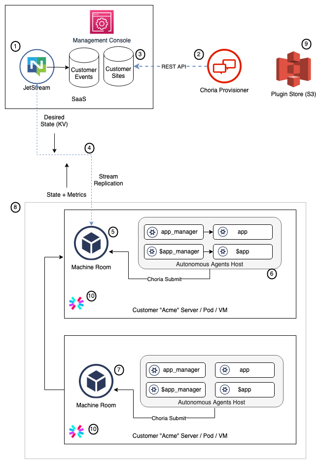

# Choria "Machine Room" MVP

Autonomous Agents have proven to be very powerful and, for certain patterns of managed software provider, could be 
a powerful tool for delivering management agents into client networks.

Imagine a SaaS who wants to provide a managed on-prem solution.  They would want to deliver an artifact that the 
user install which would deliver the software, provide management, and report back to the SaaS metrics and obtain 
desired state. The SaaS would focus on providing a user interface, reporting and ability to define desired state while
the "Machine Room" agent would obtain the desired state and apply it locally while reporting events and metrics back to
the SaaS.

With "Machine Room" we would provide all the mechanisms to enable this allowing users to supply their custom 
autonomous agents - either compiled in or over the air. This is essentially a distribution of Choria laser focussed on
the use case of managed software SaaS but without containing any SaaS specific logic at the Choria level.

 * Single-binary, Single-process per managed machine running in the Customer site hosting all Choria components (or 1 per k8s cluster)
 * RPM+JWT being all that is needed in the client site
 * Standard go binary, use `go build` or `goreleaser` or any build and deploy method
 * Standard minimal command with the possibility for a SaaS offering to extend the CLI at build time
 * Choria Provisioner hosted externally for initial flow and integration with the SaaS backend
 * On-prem local copies of the following will be provided:
   * Choria Server handling initial provisioning and hosting Autonomous Agents
   * Choria Streams for local persistence to store events/metrics/etc for later delivery to the SaaS
   * Choria Submission to allow the Autonomous Agents to submit data back to the SaaS
   * Choria Stream Replicator to handle replication of desired state from the SaaS and events to the SaaS
   * Choria Governors and Leader Election for orchestrated deploys across a cluster of nodes
   * Standard node metadata such as disks, cpu, network, memory etc shared with the SaaS regularly

For the SaaS builder they would host an isolated Choria Provisioner in a k8s namespace and a standard NATS JetStream
server where Stream Replicator will communicate with.

We'll provide guidance on various ways to configure the SaaS JetStream for accounts, streams and more so this all 
just work in a secure manner.

This will short-circuit a lot of work, allowing the SaaS to focus only on their business case:

 * The autonomous agent managing what they need managed
 * Defining desired state that would be delivered to the autonomous agent by "Machine Room"
 * Consuming metrics/events in Cloud Events format

# Components

As a core aim we want to have essentially no Choria components in the SaaS operations backend (1).  The SaaS backend
will write to KV buckets to configure customer sites and read a JetStream stream full of JSON format messages. How
the backend handles this is up to the particular SaaS but a common model would be to ingest the events into databases
so the Management Console is just a web app.

To facilitate onboarding of new customer the SaaS will issue a JWT (10).  The JWT can be per managed node or per managed 
site and will contain unique identifying information specific to the SaaS.  When a managed node gets provisioner Choria 
Provisioner (2) will reach out to the SaaS backend over a protocol like REST to retrieve information specific to the 
customer (obtained from the JWT) such as license entitlements etc. Other than this isolated REST connection the 
Provisioning layer is entirely standalone, highly available and can be globally distributed.

Each customer site (8) can be one or multiple "Machine Room" instances (5, 7).  One would be designated the leader, and it 
would host Streams, Governors, Broker, Replicator (4) and more in addition to the autonomous agents.  Essentially this 
acts as a store-and-forward point for events for that customer and acts as the only component that reaches into the 
SaaS Backend using Stream Replicator.

Each "Machine Room" instance (5, 7) will be provisioned by the Choria Provisioner and depending on state from the SaaS
will act as either leader or follower.  Followers only host Autonomous Agents and connect to the Leader using NATS 
(possibly WSS).

Within each "Machine Room" instance will run a number of Choria Autonomous Agents (6).  These will manage SaaS specific
operations like a management operator for a piece of software, some metrics or whatever else is needed.  These can
be delivered as plugins over the air from S3 (9), and so support live upgrades by the SaaS operator, or be compiled into 
the binary or a mix.

All the above "Machine Room" instances are delivered as 1 binary and runs as one process, here shown separate for clarity.
